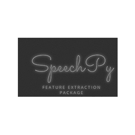









The Spe<em>echPy</em> library has provided a set of useful techniques for speech processing as well as recognition and important post-processing operations using Python commands. Various advanced speech features like MFCCs and filter-bank energies alongside the log-energy of filter-banks are fully supported by the <em>SpeechPy</em> library.

The library also aims to provide all the necessary functionalities for deep learning applications such as speech recognition (AS) or automatic speech recognition (ASR). It has provided several important functions for calculating the main speech features such as calculate MFCC features from an audio signal, computing mel-filter-banks energy, computing log Mel-filter-bank energy features from an audio signal, extracts temporal derivative features, extracting mel frequency cepstral coefficient and many more.

.




<li data-target="#diagramcarousel" data-slide-to="0"><a href="#">At a Glance</a></li>
<li data-target="#diagramcarousel" data-slide-to="2"><a href="#">Platform Independence</a></li>
<li data-target="#diagramcarousel" data-slide-to="1"><a class="activetab" href="#">Supported File Formats</a></li>






<h3>At A Glance</h3>

An overview of SpeechPy features.

<header>Features Overview</header>
<ul>
<li>Speech Processing</li>
<li>Speech Recognition</li>
<li>Compute MFCCs</li>
<li>Filterbank energies</li>
<li>MP3 support</li>
<li>Post Processing</li>
<li>Use Autoencoders</li>
<li>Extract Audio</li>
<li>Audio to Text</li>
</ul>

<header>SpeechPy</header><footer><small></small></footer>

<!--/logo-->

<!--/diagram1-->




SpeechPy supports Audio file formats as listed below.

<header><i class="fa fa-arrows-v "> </i> Reader</header>
<ul>
<li><a href="https://docs.fileformat.com/audio/mp3/">MP3</a>,  <a href="https://docs.fileformat.com/audio/wav/">WAV</a>, WMA, WEBM</li>
</ul>

<!--/left-->

<header><i class="fa  fa-long-arrow-down"> </i> Writer</header>
<ul>
<li><a href="https://docs.fileformat.com/audio/mp3/">MP3</a>,  <a href="https://docs.fileformat.com/audio/wav/">WAV</a>, WMA, WEBM </li>
</ul>

<!--/right-->

<!--/row-->

<header>SpeechPy</header><footer><small></small></footer>

<!--/logo-->

<!--/diagram2-->



<h3>Platform Independence</h3>

SpeechPy only requires Python runtime.

<header><i class="fa fa-cubes"> </i></header>
<ul>
<li>Python 2.6 & Above.</li>
</ul>

<!--/left--> <!--/right-->

<!--/row-->

<header>SpeechPy</header><footer><small></small></footer>

<!--/logo-->

<!--/diagram2 -->









<h2 class="h2title">Getting Started with <em>SpeechPy</em></h2>

The easiest way to install the SpeechPy library is using the Python Package Index (PyPI). Please use the following command for a complete installation.




<h3>Install SpeechPy using  PyPI</h3>
<pre><code class="html"> pip install speechpy </code></pre>

You can also install it manually; download the latest release files directly from the <a href="https://github.com/astorfi/speechpy/archive/master.zip">GitHub repository</a>.






<h2 class="h2title">Speech Recognition via Python</h2>

Speech Recognition is mainly concerned with the recognition and translation of spoken language into text by computers. The open source Python library SpeechPy enables software developers to create applications supporting speech recognition features.  It helps users to save time by speaking instead of typing. Thus helping users to communicate with their devices with less effort and making technological devices more accessible and easier to use.




<h3>Install SpeechPy using  PyPI</h3>
<pre><code class="html"> pip install speechpy </code></pre>

You can also install it manually; download the latest release files directly from the <a href="https://github.com/astorfi/speechpy/archive/master.zip">GitHub repository</a>.






<h2 class="h2title">Compute MFCC from Audio Signal</h2>

The Python library SpeechPy has provided complete support for computing MFCC features from an audio signal inside their own applications. The library has provided support for several important MFCC features such as sampling frequency of the signal, length of each frame in seconds,  step between successive frames in seconds, apply filters from filter-bank, number of FFT points, lowest band edge of mel filters, highest band edge of mel filters, Number of cepstral coefficients and more.




<h3>Install SpeechPy using  PyPI</h3>
<pre><code class="html"> pip install speechpy </code></pre>

You can also install it manually; download the latest release files directly from the <a href="https://github.com/astorfi/speechpy/archive/master.zip">GitHub repository</a>.






<h2 class="h2title">Extract Audio using Autoencoders</h2>

The open source Python library SpeechPy enables computer programmers to extract audio data using Python code. Autoencoder is a very effective learning technique for neural networks that learns efficient data representations. Autoencoder networks learn from each other how to compress data from the input layer into a shorter code, and then uncompress that code into whatever format best matches the original input.




<h3>Install SpeechPy using  PyPI</h3>
<pre><code class="html"> pip install speechpy </code></pre>

You can also install it manually; download the latest release files directly from the <a href="https://github.com/astorfi/speechpy/archive/master.zip">GitHub repository</a>.






 




<h3>Install SpeechPy using  PyPI</h3>
<pre><code class="html"> pip install speechpy </code></pre>

You can also install it manually; download the latest release files directly from the <a href="https://github.com/astorfi/speechpy/archive/master.zip">GitHub repository</a>.





