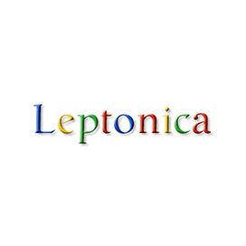









Leptonica is an open source C image processing and image analysis library that is useful for working with document images as well as natural images. The library is stable and supports numerous image formats such as JPEG, PNG, TIFF, WebP, JP2, BMP, PNM, PS, GIF, and PDF. You can easily perform reading and writing operations on the provided list of image formats. The library mostly used object-oriented approach and a set of design principles that make the code safe, portable, and transparent.

The library provides support for several important operations and a set of tools for image processing as well as image analysis. The library support operations like image scaling, translation, rotation, shear, Image transformations with changes in pixel depth, binary and gray-scale morphology, Pixelwise masking, blending, enhancement, arithmetic ops, and many more. It also supports several important utilities like for handling arrays of image-related data types such as <em>pixa</em>, <em>boxa</em>, <em>pta</em> <em>and</em> <em>other</em>.

It has also provided functions for reading and writing files having several images and writing files with special TIFF tags embedded in the header. It also allows developers to write PostScript files in a variety of formats such as transformation to PDF, raster images, and converting a PostScript file to a set of compressed images.




<li data-target="#diagramcarousel" data-slide-to="0"><a href="#">At a Glance</a></li>
<li data-target="#diagramcarousel" data-slide-to="2"><a href="#">Platform Independence</a></li>
<li data-target="#diagramcarousel" data-slide-to="1"><a class="activetab" href="#">Supported File Formats</a></li>






<h3>At A Glance</h3>

An overview of Leptonica features.

<header>Feature Overview</header>
<ul>
<li>Image resize</li>
<li>Modify images</li>
<li>Image encoding</li>
<li>image metadata</li>
<li>Image scaling,</li>
<li>Image translation</li>
<li>Image rotation</li>
<li>Image cloning</li>
</ul>

<!--/left-->

<header>Feature Overview</header>
<ul>
<li>Image watermark</li>
<li>Display images</li>
<li>Draw text</li>
<li>Image encoding</li>
<li>Image shear</li>
<li>Image transformations</li>
<li>Pixelwise masking</li>
<li>Image blending</li>
</ul>

<!--/right-->

<!--/row-->

<header>Leptonica</header><footer><small></small></footer>

<!--/logo-->

<!--/diagram1-->




Leptonica supports Word processing as well as it can export data to common file formats.

<header><i class="fa fa-arrows-v"> </i> Reader</header>
<ul>
<li>JPEG, PNG, TIFF, WebP, JP2, BMP, PNM, PS, GIF, PDF</li>
</ul>

<!--/left-->

<header><i class="fa fa-long-arrow-down"> </i> Writer</header>
<ul>
<li><a href="https://docs.fileformat.com/image/png/">PNG</a>,<a href="https://docs.fileformat.com/image/jpeg/"> JPEG</a>, <a href="https://docs.fileformat.com/image/bmp/">BMP</a>, <a href="https://docs.fileformat.com/image/tiff/">TIFF</a></li>
</ul>

<!--/right-->

<!--/row-->

<header>Leptonica</header><footer><small></small></footer>

<!--/logo-->

<!--/diagram2-->



<h3>Platform Independence</h3>

Leptonica only requires C installed.

 

 

<!-- <header><i class="fa fa-cubes"> &nbsp;</i></header>
 <ul>
 <li>Python 2.6 & above</li>
 </ul> -->

<!--/left--> <!--/right-->

<!--/row-->

<header>Leptonica</header><footer><small></small></footer>

<!--/logo-->

<!--/diagram2 -->









<h2 class="h2title">Getting Started with Leptonica</h2>

The easiest way to install Leptonica is by using via GitHub. Please use the following command for a smooth installation




<h3><strong>Install Leptonica via GitHub.</strong></h3>
<pre><code class="html">git clone --depth=1 https://github.com/mrdoob/three.js.git </code></pre>






<h2 class="h2title">Reading and writing images</h2>

The open source library Leptonica gives software developers the capability to read and write images inside their own applications. It has provided several important methods for reading and writing images such as low-level and high-level functions for reading and writing image data, functions for reading and writing files with multiple images, file with TIFF tags embedded in the header, reading JPEG files, reading and writing PostScript files and several other functions. There are some specific encoders also supported by the library.






<h2 class="h2title">Image Scaling via C Library</h2>

The open source library Leptonica has provided complete support for scaling images inside their own C application with ease. There are numerous scaling functions provided by Leptonica, such as upscaling using linear interpolation, downscaling by using subsampling, or by area mapping, sampling, 2x, and 4x linear interpolation upscaling, integer subsampling of RGB to gray or binary, and many more. Apart from that fast scaling on binary images is also offered, and is useful for image analysis of the scanned binary text.

<h2 class="h2title">Better Image Rotation via C Library</h2>

The open source library Leptonica has provided support for rotating images inside their own C applications. There are numerous ways for achieving the image rotation operation, such as rotation by shear, rotation by area mapping, special rotations by 90, 180 or 270 degrees, rotation by either 2 or 3 shear, and many more.





