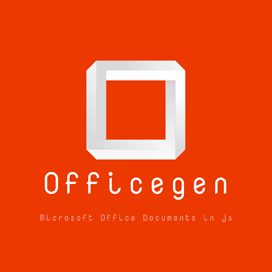









<h2 class="h2title">What is Officegen-DOCX?</h2>

Officegen-DOCX is an Open Source JavaScript library that allows software developers to work with Office Open XML files and create Word (Docx) for MS Office 2007 & later inside their own JavaScript applications.<strong>  </strong>Officegen-DOCX is very flexible and can be used on several environments. The environments that supporting Node.js  are fully compatible with it,  such as Linux, OSX and Windows.

It also supports several Word processing features for Microsoft Word document (DOCX file) such as creating Word document, add one or more paragraphs, add images, header and footer support, bookmarks and hyperlinks support.




<li data-target="#diagramcarousel" data-slide-to="0"><a href="#">At a Glance</a></li>
<li data-target="#diagramcarousel" data-slide-to="2"><a href="#">Platform Independence</a></li>
<li data-target="#diagramcarousel" data-slide-to="1"><a class="activetab" href="#">Supported File Formats</a></li>






<h3>At A Glance</h3>

An overview of Officegen-DOCX features.

 

<!--/left -->

<header>Feature Overview</header>
<ul>
<li>DOCX Creation</li>
<li>Add Paragraphs</li>
<li>Set fonts</li>
<li>Set colors</li>
<li>Text alignment</li>
<li>Add images</li>
<li>header & footer support</li>
<li>Bookmarks support</li>
<li>Hyperlinks support</li>
</ul>

<!--/right -->

<!--/row-->

<header>Officegen-DOCX</header><footer><small></small></footer>

<!--/logo-->

<!--/diagram1-->




Officegen-DOCX supports popular Microsoft Word file formats listed below.

<header><i class="fa fa-arrows-v "> </i> Reader</header>
<ul>
<li><a href="https://docs.fileformat.com/word-processing/docx/">DOCX</a></li>
</ul>

<!--/left-->

<header><i class="fa  fa-long-arrow-down"> </i> Writer</header>
<ul>
<li><a href="https://docs.fileformat.com/word-processing/txt/">TXT</a>, <a href="https://docs.fileformat.com/word-processing/docx/">DOCX</a></li>
</ul>

<!--/right-->

<!--/row-->

<header>Officegen-DOCX</header><footer><small></small></footer>

<!--/logo-->

<!--/diagram2-->



<h3>Platform Independence</h3>

Officegen-DOCX only requires  Java run-time.

 

<header><i class="fa fa-cubes"> </i>Run in</header>
<ul>
<li>JavaScript</li>
<li>NodeJS  </li>
</ul>

<!--/left--> <!--/right-->

<!--/row-->

<header>Officegen-DOCX</header><footer><small></small></footer>

<!--/logo-->

<!--/diagram2 -->









<h2 class="h2title">Getting Started with Officegen-DOCX</h2>

The most recent release of officegen-DOCX can be installed directly from the online Officegen-DOCX repository by applying the following command.




<h3>Install using officegen repository</h3>
<pre><code class="html"> $ npm install Ziv-Barber/officegen#master  </code></pre>






<h2 class="h2title">Create Word Document via Free JavaScript API</h2>

Officegen-DOCX enables software programmers to create a new Word DOCX Document inside JavaScript applications. It also enables developers to alter an existing Microsoft Word Documents according to their needs. You also can insert paragraphs, add images, align text or objects, add headers and footer, bookmarks and hyperlinks support, change font styles and more. The following simple lines of code can create Word document in JavaScript.

<ol>
<li>Instantiate officegen</li>
<li>Create an empty Word document</li>
<li>Set output path & save document</li>
</ol>
 



<h3>Create an Empty DOCX - JavaScript</h3>
<pre><code class="javascript">const officegen = require('officegen')
const fs = require('fs')
// Create an empty Word document
let docx = officegen('docx')
// Set output path
let out = fs.createWriteStream('empty.docx')
// Save
docx.generate(out)
        </code></pre>






<h2 class="h2title">Inserting Images to Word DOCX Files</h2>

Officegen-DOCX gives computer programmers the power to add images inside their Word DOCX document in JavaScript applications with few lines of code. For adding an image inside a Word documents you need to provide the name as well as the location of the image.




<h3>Add Image in DOCX - JavaScript</h3>
<pre><code class="javascript">const officegen = require('officegen')
const fs = require('fs')
// Create a new word document
let docx = officegen('docx')
// Create a new paragraph
let pObj = docx.createP()
// Add Image 
pObj.addImage('sample.jpg')
// Set output path
let out = fs.createWriteStream('image.docx')
// Save 
docx.generate(out)
        </code></pre>






<h2 class="h2title">Add Paragraphs to Word DOCX Files </h2>

Officegen-DOCX enables computer programmers to add contents in their Word DOCX files inside their own JavaScript applications. The API support adding one or more paragraphs to the word documents. It also facilitates you to set the fonts, colors, and alignment etc. for your contents with ease.




<h3>Add Paragraph in DOCX - JavaScript</h3>
<pre><code class="javascript">
const officegen = require('officegen')
const fs = require('fs')
// Create a new word document 
let docx = officegen('docx')
// Add Paragraph
let pObj = docx.createP()
// Add Text in it 
pObj.addText('FileFormat Developer Guide')
// Set output path
let out = fs.createWriteStream('fileformat.docx')
// Save
docx.generate(out)
        </code></pre>






 




